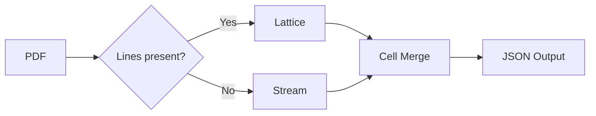
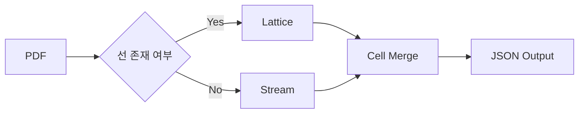

# TREX

🌍 [한국어](#-한국어) | [日本語](docs/README.ja.md) | [Español](docs/README.es.md)

**Table Rust EXtractor** — A lightweight Rust engine that extracts tables from PDFs.

```bash
trex extract invoice.pdf --format json
```

```json
[
    {
        "page": 1,
        "table_index": 0,
        "headers": ["Item", "Qty", "Unit Price", "Amount"],
        "rows": [
            ["A4 Paper", "10", "5,000", "50,000"],
            ["Toner", "2", "35,000", "70,000"]
        ]
    }
]
```

---

## Why TREX?

Existing PDF table extraction tools are concentrated in the Python ecosystem.
They require heavy runtime dependencies like OpenCV, Ghostscript, Pandas, and Java, making large-scale processing difficult in serverless environments due to memory constraints.

TREX is a lightweight alternative that runs as a single binary with no external dependencies.

- **Zero external dependencies**: No need for native libraries like OpenCV or Ghostscript
- **Low memory footprint**: Runs without OOM in serverless containers (Cloud Run, Lambda)
- **Single binary deployment**: Minimizes container image size

---

## Parsing Engine

TREX detects tables using two modes:

**Lattice** — Handles tables with visible gridlines. Detects horizontal and vertical line segments using a lightweight CV algorithm and determines cell regions from intersections. Works without OpenCV.

**Stream** — Handles tables without gridlines. Analyzes text box coordinates using clustering algorithms to infer columns and rows.

**DL Router (optional)** — Uses a lightweight page-feature model to route each page to Lattice / Stream / Blend strategy. Build with `--features dl` and provide an ONNX model path.



---

## Usage

### CLI

```bash
# Single file
trex extract report.pdf

# Specific pages only
trex extract report.pdf --pages 3,5,7

# Specify parsing mode
trex extract report.pdf --mode lattice

# DL router mode (optional)
cargo run --features dl -- extract report.pdf --mode dl --dl-model models/router.onnx

# Output format
trex extract report.pdf --format csv > output.csv

# Emit extraction event log for feedback loop
trex extract report.pdf \
  --event-log logs/extraction_events.ndjson \
  --event-document-key "doc-123" \
  --event-tenant-id "tenant-a" \
  --event-training-opt-in
```

Language output is selected from system locale (`LC_ALL`, `LC_MESSAGES`, `LANG`).
Use `TREX_LANG=ko` or `TREX_LANG=en` to override explicitly.

### Feedback Loop (Model Updates)

If you run TREX in a production chatbot/doc-processing service, collect failure events and retrain router models in batch:

```bash
python3 ml/update_router.py \
  --events logs/extraction_events.ndjson \
  --work-dir ml/artifacts/update
```

TREX does not include a built-in always-on server. Run this manually or via your own scheduler (for example, GitHub Actions schedule).

See `ml/README.md` for the full pipeline.
For custom model compatibility, see `ml/MODEL_CONTRACT.md`.

### Docker (REST API)

```bash
docker build -t trex .
docker run --rm -p 8080:8080 trex

curl -X POST http://localhost:8080/extract \
  -F "file=@invoice.pdf" \
  -F "mode=auto" \
  -F "format=json"
```

Per-request language can be controlled with `Accept-Language` (e.g. `en-US`, `ko-KR`).

### Node.js

```bash
npm install @dreamyoungs/trex
```

```javascript
const { extract } = require("@dreamyoungs/trex");

const tables = await extract("invoice.pdf", {
  pages: [1, 2],
  mode: "auto",
  // optional: override CLI path
  // binPath: "/usr/local/bin/trex",
});

console.log(tables[0].rows);
```

The npm package is a CLI wrapper.
On install, it tries to download a matching TREX binary from GitHub Releases.
If auto-download is unavailable, set `TREX_BIN` (or `binPath`) to a local TREX binary.
Maintainers can publish release assets with `scripts/release/publish_assets.sh`.

For native Node.js bindings (NAPI-RS), see `bindings/node`:

```bash
cd bindings/node
npm install
npm run build
```

### Python

```python
import trex

tables = trex.extract("invoice.pdf", pages=[1, 2])
print(tables[0].rows)
```

---

## Design Principles

TREX **does one thing**: converts the physical table layout on a page into a 2D array.

Things it intentionally does NOT do:

- LLM-based document analysis or contextual interpretation
- Automatic merging of tables spanning multiple pages
- Header normalization, data type inference, or other business logic

Such post-processing should be handled by the application layer consuming TREX's output.

---

## Tech Stack

| Area             | Choice                  | Note                  |
| ---------------- | ----------------------- | --------------------- |
| Language         | Rust                    |                       |
| PDF Parser       | `lopdf` / `pdf-extract` | Low-level PDF access  |
| HTTP Server      | Axum                    | For Docker REST API   |
| Python Bindings  | PyO3 + maturin          | `pip install` support |
| Node.js          | CLI wrapper + NAPI-RS   | `npm/trex`, `bindings/node` |

---

## Roadmap

- [x] Docker REST API server
- [ ] PyO3 Python bindings
- [x] Node.js npm wrapper package
- [x] NAPI-RS Node.js bindings
- [ ] WebAssembly build (in-browser)
- [ ] Benchmark suite with real-world comparisons

---

## License

MIT OR Apache-2.0

---

<br>

# 🇰🇷 한국어

**Table Rust EXtractor** — PDF에서 표(Table)만 추출하는 Rust 엔진.

```bash
trex extract invoice.pdf --format json
```

```json
[
    {
        "page": 1,
        "table_index": 0,
        "headers": ["항목", "수량", "단가", "금액"],
        "rows": [
            ["A4 용지", "10", "5,000", "50,000"],
            ["토너", "2", "35,000", "70,000"]
        ]
    }
]
```

---

## 왜 TREX인가

기존 PDF 테이블 추출 도구들은 파이썬 생태계에 집중되어 있습니다.
OpenCV, Ghostscript, Pandas, Java 등 무거운 런타임 의존성이 필요하고, 서버리스 환경에서는 메모리 제약으로 인해 대용량 처리가 어렵습니다.

TREX는 외부 의존성 없이 단일 바이너리로 동작하는 경량 대안입니다.

- **외부 의존성 제로**: OpenCV, Ghostscript 등 네이티브 라이브러리 불필요
- **낮은 메모리 사용**: 서버리스 컨테이너(Cloud Run, Lambda)에서 OOM 없이 동작
- **단일 바이너리 배포**: 컨테이너 이미지 크기 최소화

---

## 파싱 엔진

TREX는 두 가지 모드로 표를 탐지합니다.

**Lattice** — 격자선이 있는 표를 처리합니다. 경량 CV 알고리즘으로 수평/수직 선분을 탐지하고 교차점으로부터 셀 영역을 결정합니다. OpenCV 없이 동작합니다.

**Stream** — 격자선이 없는 표를 처리합니다. 텍스트 박스의 좌표를 군집화(Clustering) 알고리즘으로 분석하여 열(Column)과 행(Row)을 추론합니다.

**DL Router(선택)** — 페이지 피처 기반 모델로 Lattice / Stream / Blend 전략을 선택합니다. `--features dl`로 빌드하고 ONNX 모델 경로를 전달하면 사용할 수 있습니다.



---

## 사용 방법

### CLI

```bash
# 단일 파일
trex extract report.pdf

# 특정 페이지만
trex extract report.pdf --pages 3,5,7

# 파싱 모드 지정
trex extract report.pdf --mode lattice

# DL 라우터 모드 (선택)
cargo run --features dl -- extract report.pdf --mode dl --dl-model models/router.onnx

# 출력 형식
trex extract report.pdf --format csv > output.csv

# 피드백 루프용 이벤트 로그 기록
trex extract report.pdf \
  --event-log logs/extraction_events.ndjson \
  --event-document-key "doc-123" \
  --event-tenant-id "tenant-a" \
  --event-training-opt-in
```

출력 언어는 시스템 로케일(`LC_ALL`, `LC_MESSAGES`, `LANG`)을 기준으로 선택됩니다.
명시적으로 고정하려면 `TREX_LANG=ko` 또는 `TREX_LANG=en`을 사용하세요.

### 피드백 루프(모델 업데이트)

챗봇/문서 처리 서비스에서 실패 이벤트를 모은 뒤 배치 학습으로 라우터 모델을 업데이트할 수 있습니다.

```bash
python3 ml/update_router.py \
  --events logs/extraction_events.ndjson \
  --work-dir ml/artifacts/update
```

TREX 자체에 항상 실행되는 서버는 없으므로, 수동 실행 또는 별도 스케줄러(예: GitHub Actions schedule)로 운영하세요.

전체 절차는 `ml/README.md`를 참고하세요.
커스텀 모델 입출력 호환 규격은 `ml/MODEL_CONTRACT.md`를 참고하세요.

### Docker (REST API)

```bash
docker build -t trex .
docker run --rm -p 8080:8080 trex

curl -X POST http://localhost:8080/extract \
  -F "file=@invoice.pdf" \
  -F "mode=auto" \
  -F "format=json"
```

요청 단위 언어는 `Accept-Language` 헤더(`en-US`, `ko-KR` 등)로 제어할 수 있습니다.

### Node.js

```bash
npm install @dreamyoungs/trex
```

```javascript
const { extract } = require("@dreamyoungs/trex");

const tables = await extract("invoice.pdf", {
  pages: [1, 2],
  mode: "auto",
  // 선택: CLI 경로 직접 지정
  // binPath: "/usr/local/bin/trex",
});

console.log(tables[0].rows);
```

npm 패키지는 CLI 래퍼입니다.
설치 시 GitHub Releases에서 플랫폼에 맞는 TREX 바이너리 다운로드를 시도합니다.
자동 다운로드가 불가능하면 로컬 바이너리 경로를 `TREX_BIN`(또는 `binPath`)으로 지정하세요.
메인테이너는 `scripts/release/publish_assets.sh` 스크립트로 릴리즈 바이너리를 업로드할 수 있습니다.

네이티브 Node.js 바인딩(NAPI-RS)은 `bindings/node`를 사용하세요:

```bash
cd bindings/node
npm install
npm run build
```

### Python

```python
import trex

tables = trex.extract("invoice.pdf", pages=[1, 2])
print(tables[0].rows)
```

---

## 설계 원칙

TREX는 **한 가지 일만 합니다**: 페이지 위의 물리적 표 레이아웃을 2D 배열로 변환하는 것.

의도적으로 하지 않는 것들:

- LLM 기반 문서 분석이나 문맥 해석
- 페이지를 넘나드는 표의 자동 병합
- 헤더 정규화, 데이터 타입 추론 등 비즈니스 로직

이런 후처리는 TREX의 출력을 받아 상위 애플리케이션에서 처리하는 것이 올바른 구조입니다.

---

## 기술 스택

| 영역           | 선택                    | 비고                 |
| -------------- | ----------------------- | -------------------- |
| 언어           | Rust                    |                      |
| PDF 파서       | `lopdf` / `pdf-extract` | 저수준 PDF 구조 접근 |
| HTTP 서버      | Axum                    | Docker REST API 용   |
| Python 바인딩  | PyO3 + maturin          | `pip install` 지원   |
| Node.js        | CLI 래퍼 + NAPI-RS      | `npm/trex`, `bindings/node` |

---

## 로드맵

- [x] Docker REST API 서버
- [ ] PyO3 Python 바인딩
- [x] Node.js npm 래퍼 패키지
- [x] NAPI-RS Node.js 바인딩
- [ ] WebAssembly 빌드 (브라우저 내 동작)
- [ ] 벤치마크 스위트 및 실측 비교

---

## 라이선스

MIT OR Apache-2.0
