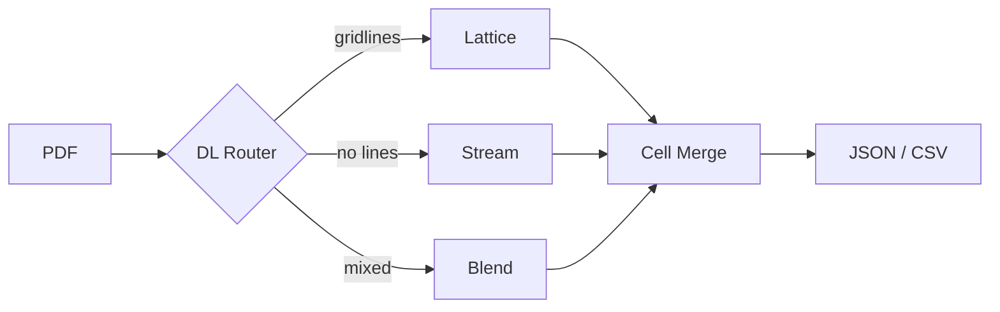
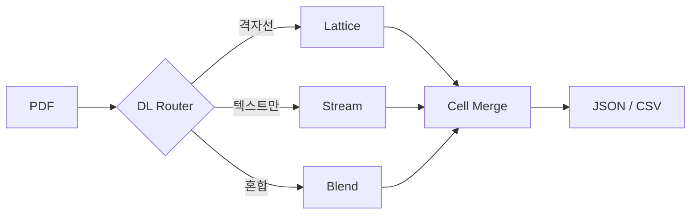

# 🦖 TREX

🌍 [한국어](#-한국어) | [日本語](docs/README.ja.md) | [Español](docs/README.es.md)

**Table Rust EXtractor** — Extract tables from PDFs with zero native dependencies. Built in Rust, usable from Node.js and Python.

[](LICENSE-MIT)

## Quick Start

### Node.js

Two packages are available — choose the one that fits your use case:

| Package                  | Install                        | How it works                             |
| ------------------------ | ------------------------------ | ---------------------------------------- |
| `@dreamyoungs/trex`      | `npm i @dreamyoungs/trex`      | CLI wrapper — auto-downloads TREX binary |
| `@dreamyoungs/trex-node` | `npm i @dreamyoungs/trex-node` | Native NAPI-RS binding — no subprocess   |

```javascript
// Both packages share the same API
const { extract } = require("@dreamyoungs/trex"); // CLI wrapper
// const { extract } = require("@dreamyoungs/trex-node"); // or native binding

const tables = await extract("invoice.pdf", {
    pages: [1, 2],
    mode: "auto"
});

console.log(tables[0].headers); // ["Item", "Qty", "Unit Price", "Amount"]
console.log(tables[0].rows); // [["A4 Paper", "10", "5,000", "50,000"], ...]
```

### CLI

```bash
trex extract invoice.pdf --format json
trex extract invoice.pdf --format csv > output.csv
trex extract invoice.pdf --pages 3,5,7 --mode lattice
```

### Docker

```bash
docker build -t trex .
docker run --rm -p 8080:8080 trex

curl -X POST http://localhost:8080/extract \
  -F "file=@invoice.pdf" \
  -F "mode=auto" \
  -F "format=json"
```

---

## Why TREX?

PDF table extraction has long been dominated by the Python ecosystem — tools like Camelot, Tabula, and pdfplumber all require heavy runtimes (OpenCV, Ghostscript, Java) and struggle with memory limits in serverless environments.

TREX takes a different approach:

|                      | Python tools                  | TREX                            |
| -------------------- | ----------------------------- | ------------------------------- |
| **Runtime**          | Python + OpenCV + Ghostscript | Single Rust binary              |
| **Memory**           | 200–500 MB+                   | ~30 MB                          |
| **Container size**   | 500 MB+                       | ~15 MB                          |
| **Language support** | Python only                   | Rust, Node.js, Python, Docker   |
| **Improvement loop** | Manual                        | DL Router + ML training scripts |

### Key Advantages

- **🚀 Lightweight & Fast** — Single binary, no native dependencies. Runs instantly in serverless containers (Cloud Run, Lambda) without OOM issues.
- **🧠 Improvable with DL** — An optional DL Router can be retrained on extraction failures to improve table detection accuracy. You run the training pipeline manually or via your own scheduler (e.g. GitHub Actions cron).
- **🌍 Multi-Runtime** — Use TREX from Node.js (`npm install`), Python (`pip install`), Docker REST API, or the CLI. The same Rust core powers all of them.
- **🔧 Production-Ready Telemetry** — Built-in event logging (`--event-log`) captures extraction metrics for production monitoring. Collected events can be fed into the ML training pipeline to retrain the router model.

---

## Parsing Engine

TREX detects tables using three strategies:

**Lattice** — For tables with visible gridlines. Detects line segments and computes cell regions from intersections. No OpenCV required.

**Stream** — For tables without gridlines. Clusters text box coordinates to infer columns and rows.

**DL Router** _(optional)_ — A lightweight ONNX model analyzes page features and routes each page to the optimal strategy (Lattice / Stream / Blend). When no model is provided, a built-in heuristic router is used instead.



### Feedback Loop

Collect extraction events in production and retrain the router model in batch:

```bash
# 1. Run TREX with event logging enabled
trex extract report.pdf \
  --event-log logs/extraction_events.ndjson \
  --event-document-key "doc-123" \
  --event-training-opt-in

# 2. Retrain the router model
python3 ml/update_router.py \
  --events logs/extraction_events.ndjson \
  --work-dir ml/artifacts/update
```

This is not an always-on server — run it manually or via a scheduler (e.g. GitHub Actions cron).
See [`ml/README.md`](ml/README.md) for the full pipeline and [`ml/MODEL_CONTRACT.md`](ml/MODEL_CONTRACT.md) for model I/O specs.

---

## Usage Details

### CLI Options

```bash
trex extract <file.pdf> [OPTIONS]

Options:
  --pages <1,3,5 | 1-10>     Pages to process
  --mode <auto|lattice|stream|dl>  Parsing mode (default: auto)
  --format <json|csv>         Output format (default: json)
  --dl-model <path.onnx>      DL router model path (requires --features dl)
  --dl-min-confidence <0.55>  Min confidence for DL routing
  --event-log <path.ndjson>   Write extraction events for feedback loop
  --event-document-key <key>  Document identifier for events
  --event-tenant-id <id>      Tenant identifier
  --event-training-opt-in     Allow this data for model training
```

Language output follows system locale (`LC_ALL`, `LANG`). Override with `TREX_LANG=ko` or `TREX_LANG=en`.

### Node.js

#### `@dreamyoungs/trex` — CLI wrapper (recommended)

```bash
npm install @dreamyoungs/trex
```

Auto-downloads a platform TREX binary on install. If download fails, set `TREX_BIN` or pass `binPath`.

```javascript
const { extract, extractCsv, extractFromBuffer } = require("@dreamyoungs/trex");

const tables = await extract("invoice.pdf", {
    pages: [1, 2],
    mode: "auto"
    // binPath: "/usr/local/bin/trex",  // optional: override binary path
});
```

#### `@dreamyoungs/trex-node` — Native binding (faster)

```bash
npm install @dreamyoungs/trex-node
```

NAPI-RS native binding — calls Rust directly with no subprocess overhead. Same API as the CLI wrapper.

```javascript
const { extract } = require("@dreamyoungs/trex-node");
const tables = extract("invoice.pdf", { mode: "Auto" }); // synchronous
```

### Python

```python
import trex

tables = trex.extract("invoice.pdf", pages=[1, 2])
print(tables[0].rows)
```

### Docker REST API

```bash
docker build -t trex .
docker run --rm -p 8080:8080 trex
```

Per-request language: `Accept-Language: ko-KR` header.

---

## Design Principles

TREX **does one thing**: converts the physical table layout on a page into a 2D array.

Things it intentionally does **not** do: LLM-based analysis, cross-page table merging, header normalization, or data type inference. These belong in the application layer consuming TREX's output.

---

## Tech Stack

| Area            | Choice                  | Note                        |
| --------------- | ----------------------- | --------------------------- |
| Language        | Rust                    | Core engine                 |
| PDF Parser      | `lopdf` / `pdf-extract` | Low-level PDF access        |
| DL Runtime      | `tract-onnx` (optional) | ONNX model inference        |
| HTTP Server     | Axum                    | Docker REST API             |
| Node.js         | CLI wrapper + NAPI-RS   | `npm/trex`, `bindings/node` |
| Python Bindings | PyO3 + maturin          | `pip install` support       |

---

## Roadmap

- [x] Lattice mode (gridline-based extraction)
- [x] Stream mode (coordinate-based inference)
- [x] DL Router with feedback pipeline
- [x] CLI interface
- [x] Docker REST API server
- [x] Node.js npm wrapper + NAPI-RS bindings
- [ ] PyO3 Python bindings
- [ ] WebAssembly build (in-browser)
- [ ] Benchmark suite with real-world comparisons

---

## License

MIT OR Apache-2.0

---

<br>

# 🇰🇷 한국어

**Table Rust EXtractor** — 외부 의존성 없이 PDF에서 표를 추출하는 Rust 엔진. Node.js와 Python에서 바로 사용할 수 있습니다.

## 빠른 시작

### Node.js

두 가지 패키지가 있습니다 — 용도에 맞게 선택하세요:

| 패키지                   | 설치                           | 방식                                        |
| ------------------------ | ------------------------------ | ------------------------------------------- |
| `@dreamyoungs/trex`      | `npm i @dreamyoungs/trex`      | CLI 래퍼 — TREX 바이너리 자동 다운로드      |
| `@dreamyoungs/trex-node` | `npm i @dreamyoungs/trex-node` | NAPI-RS 네이티브 바인딩 — 서브프로세스 없음 |

```javascript
// 두 패키지 모두 동일한 API
const { extract } = require("@dreamyoungs/trex"); // CLI 래퍼
// const { extract } = require("@dreamyoungs/trex-node"); // 또는 네이티브 바인딩

const tables = await extract("invoice.pdf", {
    pages: [1, 2],
    mode: "auto"
});

console.log(tables[0].headers); // ["항목", "수량", "단가", "금액"]
console.log(tables[0].rows); // [["A4 용지", "10", "5,000", "50,000"], ...]
```

### CLI

```bash
trex extract invoice.pdf --format json
trex extract invoice.pdf --format csv > output.csv
trex extract invoice.pdf --pages 3,5,7 --mode lattice
```

### Docker

```bash
docker build -t trex .
docker run --rm -p 8080:8080 trex

curl -X POST http://localhost:8080/extract \
  -F "file=@invoice.pdf" \
  -F "mode=auto" \
  -F "format=json"
```

---

## 왜 TREX인가

PDF 테이블 추출은 오랫동안 파이썬 생태계가 독점해 왔습니다. Camelot, Tabula, pdfplumber 등 모든 도구가 무거운 런타임(OpenCV, Ghostscript, Java)을 필요로 하며, 서버리스 환경에서는 메모리 제한으로 대용량 처리가 어렵습니다.

TREX는 다른 접근 방식을 택합니다:

|                   | 기존 파이썬 도구              | TREX                          |
| ----------------- | ----------------------------- | ----------------------------- |
| **런타임**        | Python + OpenCV + Ghostscript | 단일 Rust 바이너리            |
| **메모리**        | 200–500 MB+                   | ~30 MB                        |
| **컨테이너 크기** | 500 MB+                       | ~15 MB                        |
| **언어 지원**     | Python만 가능                 | Rust, Node.js, Python, Docker |
| **개선 루프**     | 수동                          | DL Router + ML 학습 스크립트  |

### 핵심 장점

- **🚀 경량 & 고속** — 단일 바이너리, 네이티브 의존성 제로. 서버리스 컨테이너(Cloud Run, Lambda)에서 OOM 없이 즉시 실행.
- **🧠 DL 기반 개선 가능** — 선택적 DL Router를 추출 실패 데이터로 재학습하여 정확도를 높일 수 있습니다. 학습 파이프라인은 수동 실행 또는 스케줄러(예: GitHub Actions cron)로 운영합니다.
- **🌍 멀티 런타임** — Node.js(`npm install`), Python(`pip install`), Docker REST API, CLI 모두 지원. 동일한 Rust 코어가 모든 환경을 구동합니다.
- **🔧 프로덕션 레디 텔레메트리** — 내장 이벤트 로그(`--event-log`)로 추출 메트릭을 캡처하여 모니터링에 활용합니다. 수집된 이벤트를 ML 학습 파이프라인에 넣어 라우터 모델을 재학습할 수 있습니다.

---

## 파싱 엔진

TREX는 세 가지 전략으로 표를 탐지합니다.

**Lattice** — 격자선이 있는 표를 처리합니다. 선분을 탐지하고 교차점으로부터 셀 영역을 결정합니다. OpenCV 불필요.

**Stream** — 격자선이 없는 표를 처리합니다. 텍스트 박스 좌표를 군집화하여 열과 행을 추론합니다.

**DL Router** _(선택)_ — 경량 ONNX 모델이 페이지 피처를 분석하여 최적 전략(Lattice / Stream / Blend)을 선택합니다. 모델이 없으면 내장 휴리스틱 라우터가 대체합니다.



### 피드백 루프

운영 환경에서 추출 이벤트를 수집하고 라우터 모델을 배치 재학습합니다:

```bash
# 1. 이벤트 로그 활성화하여 실행
trex extract report.pdf \
  --event-log logs/extraction_events.ndjson \
  --event-document-key "doc-123" \
  --event-training-opt-in

# 2. 라우터 모델 재학습
python3 ml/update_router.py \
  --events logs/extraction_events.ndjson \
  --work-dir ml/artifacts/update
```

상시 실행 서버가 아닙니다 — 수동 실행 또는 스케줄러(예: GitHub Actions cron)로 운영하세요.
전체 파이프라인은 [`ml/README.md`](ml/README.md), 모델 I/O 스펙은 [`ml/MODEL_CONTRACT.md`](ml/MODEL_CONTRACT.md)를 참고하세요.

---

## 상세 사용법

### CLI 옵션

```bash
trex extract <file.pdf> [OPTIONS]

Options:
  --pages <1,3,5 | 1-10>     처리할 페이지
  --mode <auto|lattice|stream|dl>  파싱 모드 (기본: auto)
  --format <json|csv>         출력 형식 (기본: json)
  --dl-model <path.onnx>      DL 라우터 모델 경로 (--features dl 필요)
  --dl-min-confidence <0.55>  DL 라우팅 최소 신뢰도
  --event-log <path.ndjson>   피드백 루프용 이벤트 기록
  --event-document-key <key>  이벤트 문서 식별자
  --event-tenant-id <id>      테넌트 식별자
  --event-training-opt-in     학습 데이터 활용 동의
```

출력 언어는 시스템 로케일(`LC_ALL`, `LANG`)을 따릅니다. `TREX_LANG=ko` 또는 `TREX_LANG=en`으로 명시적 지정 가능.

### Node.js

#### `@dreamyoungs/trex` — CLI 래퍼 (권장)

```bash
npm install @dreamyoungs/trex
```

설치 시 플랫폼 TREX 바이너리를 자동 다운로드. 실패 시 `TREX_BIN` 또는 `binPath`로 지정.

```javascript
const { extract, extractCsv, extractFromBuffer } = require("@dreamyoungs/trex");

const tables = await extract("invoice.pdf", {
    pages: [1, 2],
    mode: "auto"
    // binPath: "/usr/local/bin/trex",  // 선택: 바이너리 경로 직접 지정
});
```

#### `@dreamyoungs/trex-node` — 네이티브 바인딩 (고속)

```bash
npm install @dreamyoungs/trex-node
```

NAPI-RS 네이티브 바인딩 — Rust를 직접 호출하여 서브프로세스 오버헤드 없음. CLI 래퍼와 동일한 API.

```javascript
const { extract } = require("@dreamyoungs/trex-node");
const tables = extract("invoice.pdf", { mode: "Auto" }); // 동기 호출
```

### Python

```python
import trex

tables = trex.extract("invoice.pdf", pages=[1, 2])
print(tables[0].rows)
```

### Docker REST API

```bash
docker build -t trex .
docker run --rm -p 8080:8080 trex
```

요청 단위 언어: `Accept-Language: ko-KR` 헤더 사용.

---

## 설계 원칙

TREX는 **한 가지 일만 합니다**: 페이지 위의 물리적 표 레이아웃을 2D 배열로 변환.

의도적으로 하지 않는 것: LLM 기반 분석, 페이지 간 표 병합, 헤더 정규화, 데이터 타입 추론. 이런 후처리는 TREX 출력을 소비하는 애플리케이션 레이어에서 처리해야 합니다.

---

## 기술 스택

| 영역          | 선택                    | 비고                        |
| ------------- | ----------------------- | --------------------------- |
| 언어          | Rust                    | 코어 엔진                   |
| PDF 파서      | `lopdf` / `pdf-extract` | 저수준 PDF 구조 접근        |
| DL 런타임     | `tract-onnx` (선택)     | ONNX 모델 추론              |
| HTTP 서버     | Axum                    | Docker REST API             |
| Node.js       | CLI 래퍼 + NAPI-RS      | `npm/trex`, `bindings/node` |
| Python 바인딩 | PyO3 + maturin          | `pip install` 지원          |

---

## 로드맵

- [x] Lattice 모드 (격자선 기반 추출)
- [x] Stream 모드 (좌표 기반 추론)
- [x] DL Router + 피드백 파이프라인
- [x] CLI 인터페이스
- [x] Docker REST API 서버
- [x] Node.js npm 래퍼 + NAPI-RS 바인딩
- [ ] PyO3 Python 바인딩
- [ ] WebAssembly 빌드 (브라우저 내 동작)
- [ ] 벤치마크 스위트 및 실측 비교

---

## 라이선스

MIT OR Apache-2.0
