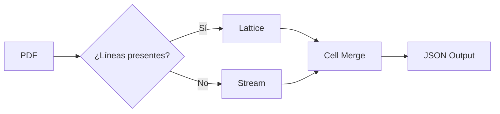

# TREX

🌍 [English](../README.md) | [한국어](../README.md#-한국어) | [日本語](README.ja.md)

**Table Rust EXtractor** — Un motor ligero en Rust que extrae tablas de archivos PDF.

```bash
trex extract invoice.pdf --format json
```

```json
[
    {
        "page": 1,
        "table_index": 0,
        "headers": ["Artículo", "Cantidad", "Precio unitario", "Importe"],
        "rows": [
            ["Papel A4", "10", "5,000", "50,000"],
            ["Tóner", "2", "35,000", "70,000"]
        ]
    }
]
```

---

## ¿Por qué TREX?

Las herramientas existentes para la extracción de tablas de PDF se concentran en el ecosistema Python.
Requieren dependencias pesadas como OpenCV, Ghostscript, Pandas y Java, lo que dificulta el procesamiento a gran escala en entornos serverless debido a las limitaciones de memoria.

TREX es una alternativa ligera que se ejecuta como un único binario sin dependencias externas.

- **Cero dependencias externas**: No requiere bibliotecas nativas como OpenCV o Ghostscript
- **Bajo consumo de memoria**: Funciona sin OOM en contenedores serverless (Cloud Run, Lambda)
- **Despliegue de un solo binario**: Minimiza el tamaño de la imagen del contenedor

---

## Motor de Análisis

TREX detecta tablas utilizando dos modos:

**Lattice** — Maneja tablas con líneas de cuadrícula visibles. Detecta segmentos de línea horizontales y verticales mediante un algoritmo CV ligero y determina las regiones de celda a partir de las intersecciones. Funciona sin OpenCV.

**Stream** — Maneja tablas sin líneas de cuadrícula. Analiza las coordenadas de los cuadros de texto mediante algoritmos de clustering para inferir columnas y filas.



---

## Uso

### CLI

```bash
# Archivo individual
trex extract report.pdf

# Solo páginas específicas
trex extract report.pdf --pages 3,5,7

# Especificar modo de análisis
trex extract report.pdf --mode lattice

# Formato de salida
trex extract report.pdf --format csv > output.csv
```

### Docker (REST API)

```bash
docker run -p 8080:8080 ghcr.io/dreamyoungs/trex

curl -X POST http://localhost:8080/extract \
  -F "file=@invoice.pdf" \
  -H "Accept: application/json"
```

### Node.js

Hay dos paquetes disponibles — elige el que mejor se adapte a tu caso:

| Paquete                  | Instalación                    | Método                                             |
| ------------------------ | ------------------------------ | -------------------------------------------------- |
| `@dreamyoungs/trex`      | `npm i @dreamyoungs/trex`      | CLI wrapper — descarga automática del binario TREX |
| `@dreamyoungs/trex-node` | `npm i @dreamyoungs/trex-node` | Binding nativo NAPI-RS — sin subproceso            |

```javascript
// Ambos paquetes comparten la misma API
const { extract } = require("@dreamyoungs/trex"); // CLI wrapper
// const { extract } = require("@dreamyoungs/trex-node"); // o binding nativo

const tables = await extract("invoice.pdf", {
    pages: [1, 2],
    mode: "auto"
});

console.log(tables[0].rows);
```

### Python

```python
import trex

tables = trex.extract("invoice.pdf", pages=[1, 2])
print(tables[0].rows)
```

---

## Principios de Diseño

TREX **hace una sola cosa**: convierte el diseño físico de tablas en una página en un arreglo 2D.

Cosas que intencionalmente NO hace:

- Análisis de documentos basado en LLM o interpretación contextual
- Fusión automática de tablas que abarcan múltiples páginas
- Normalización de encabezados, inferencia de tipos de datos u otra lógica de negocio

Dicho post-procesamiento debe ser manejado por la capa de aplicación que consume la salida de TREX.

---

## Stack Tecnológico

| Área             | Elección                | Nota                     |
| ---------------- | ----------------------- | ------------------------ |
| Lenguaje         | Rust                    |                          |
| Parser PDF       | `lopdf` / `pdf-extract` | Acceso PDF de bajo nivel |
| Servidor HTTP    | Axum                    | Para Docker REST API     |
| Bindings Python  | PyO3 + maturin          | Soporte `pip install`    |
| Bindings Node.js | NAPI-RS                 | Soporte `npm install`    |

---

## Hoja de Ruta

- [ ] Servidor Docker REST API
- [ ] Bindings Python con PyO3
- [ ] Bindings Node.js con NAPI-RS
- [ ] Build WebAssembly (en navegador)
- [ ] Suite de benchmarks con comparaciones reales

---

## Licencia

MIT OR Apache-2.0
