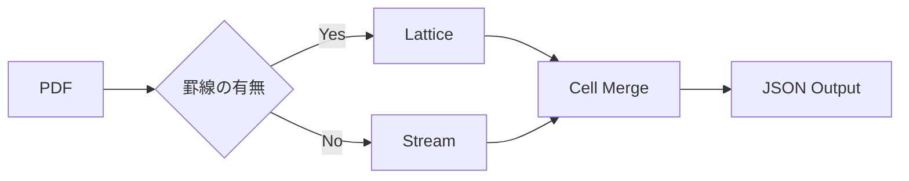

# TREX

🌍 [English](../README.md) | [한국어](../README.md#-한국어) | [Español](README.es.md)

**Table Rust EXtractor** — PDFからテーブル（表）のみを抽出するRustエンジン。

```bash
trex extract invoice.pdf --format json
```

```json
[
    {
        "page": 1,
        "table_index": 0,
        "headers": ["品目", "数量", "単価", "金額"],
        "rows": [
            ["A4用紙", "10", "5,000", "50,000"],
            ["トナー", "2", "35,000", "70,000"]
        ]
    }
]
```

---

## なぜTREXなのか

既存のPDFテーブル抽出ツールはPythonエコシステムに集中しています。
OpenCV、Ghostscript、Pandas、Javaなど重いランタイム依存関係が必要で、サーバーレス環境ではメモリ制約により大規模処理が困難です。

TREXは外部依存関係なしで単一バイナリとして動作する軽量な代替手段です。

- **外部依存関係ゼロ**: OpenCV、Ghostscriptなどのネイティブライブラリ不要
- **低メモリ使用量**: サーバーレスコンテナ（Cloud Run、Lambda）でOOMなく動作
- **単一バイナリデプロイ**: コンテナイメージサイズを最小化

---

## パーシングエンジン

TREXは2つのモードでテーブルを検出します。

**Lattice** — 罫線のあるテーブルを処理します。軽量CVアルゴリズムで水平・垂直線分を検出し、交差点からセル領域を決定します。OpenCVなしで動作します。

**Stream** — 罫線のないテーブルを処理します。テキストボックスの座標をクラスタリングアルゴリズムで分析し、列（Column）と行（Row）を推論します。



---

## 使用方法

### CLI

```bash
# 単一ファイル
trex extract report.pdf

# 特定ページのみ
trex extract report.pdf --pages 3,5,7

# パーシングモード指定
trex extract report.pdf --mode lattice

# 出力形式
trex extract report.pdf --format csv > output.csv
```

### Docker (REST API)

```bash
docker run -p 8080:8080 ghcr.io/dreamyoungs/trex

curl -X POST http://localhost:8080/extract \
  -F "file=@invoice.pdf" \
  -H "Accept: application/json"
```

### Node.js

2つのパッケージから選択できます:

| パッケージ               | インストール                   | 方式                                               |
| ------------------------ | ------------------------------ | -------------------------------------------------- |
| `@dreamyoungs/trex`      | `npm i @dreamyoungs/trex`      | CLIラッパー — TREXバイナリ自動ダウンロード         |
| `@dreamyoungs/trex-node` | `npm i @dreamyoungs/trex-node` | NAPI-RSネイティブバインディング — サブプロセスなし |

```javascript
// 両パッケージとも同じAPI
const { extract } = require("@dreamyoungs/trex"); // CLIラッパー
// const { extract } = require("@dreamyoungs/trex-node"); // またはネイティブ

const tables = await extract("invoice.pdf", {
    pages: [1, 2],
    mode: "auto"
});

console.log(tables[0].rows);
```

### Python

```python
import trex

tables = trex.extract("invoice.pdf", pages=[1, 2])
print(tables[0].rows)
```

---

## 設計原則

TREXは**1つのことだけを行います**: ページ上の物理的なテーブルレイアウトを2D配列に変換すること。

意図的に行わないこと:

- LLMベースの文書分析やコンテキスト解釈
- ページをまたぐテーブルの自動マージ
- ヘッダー正規化、データ型推論などのビジネスロジック

これらの後処理はTREXの出力を受け取り、上位アプリケーションで処理するのが正しいアーキテクチャです。

---

## 技術スタック

| 領域                  | 選択                    | 備考                    |
| --------------------- | ----------------------- | ----------------------- |
| 言語                  | Rust                    |                         |
| PDFパーサー           | `lopdf` / `pdf-extract` | 低レベルPDF構造アクセス |
| HTTPサーバー          | Axum                    | Docker REST API用       |
| Pythonバインディング  | PyO3 + maturin          | `pip install` 対応      |
| Node.jsバインディング | NAPI-RS                 | `npm install` 対応      |

---

## ロードマップ

- [ ] Docker REST APIサーバー
- [ ] PyO3 Pythonバインディング
- [ ] NAPI-RS Node.jsバインディング
- [ ] WebAssemblyビルド（ブラウザ内動作）
- [ ] ベンチマークスイート及び実測比較

---

## ライセンス

MIT OR Apache-2.0
